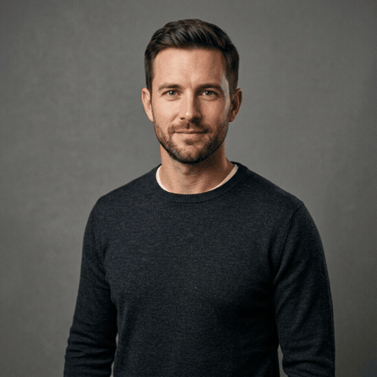
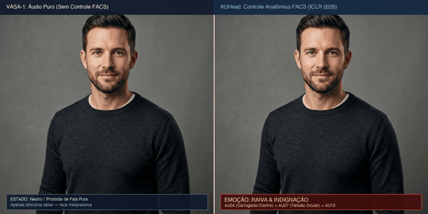
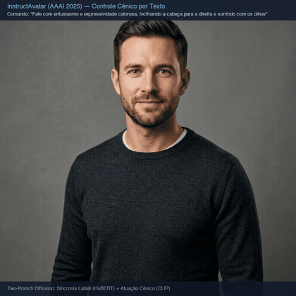
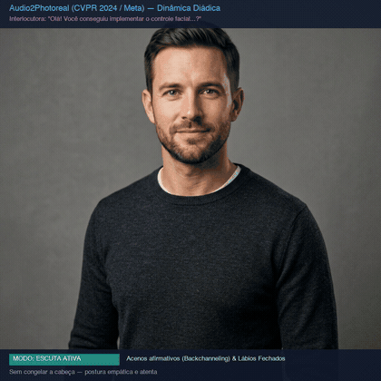
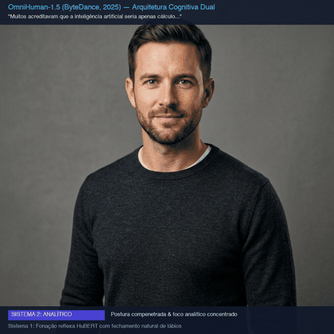
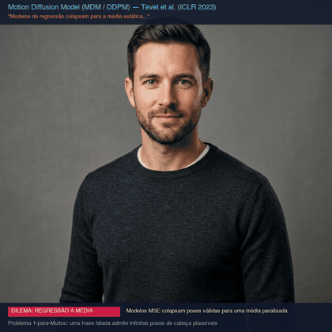
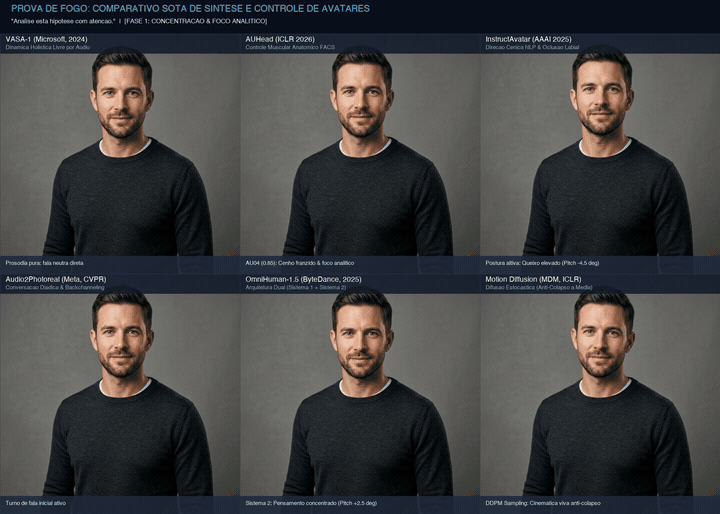

# Experimentos Avatar 01 — Humans

Repositório de pesquisa científica e implementações práticas para **síntese, animação neural foto-realista e controle comportamental de avatares humanos** a partir de áudio de fala e linguagem natural.

O projeto investiga os princípios de modelos do estado da arte (SOTA): desde a cinemática de deformação canônica em espaços latentes 3D até a modelagem generativa por difusão estocástica e arquiteturas cognitivas duais.

---

## Nota Tecnica sobre a Abordagem: Engenharia Reversa e Emulacao Pratica

E fundamental pontuar a realidade tecnica deste segmento: a grande maioria dos modelos de ponta estudados (**VASA-1** da Microsoft Research, **OmniHuman-1.5** da ByteDance, **Audio2Photoreal** da Meta Reality Labs, **InstructAvatar** e **AUHead**) **nao possuem codigo-fonte nem pesos liberados publicamente** pelas empresas.

Por esse motivo, o trabalho aqui realizado consiste em uma **engenharia pragmatica controlada**:
1. Utilizamos a espinha dorsal de codigo aberto do **LivePortrait / Ditto (ACM MM 2025)** como motor neural e espaco latente compartilhado (21 keypoints 3D implicitos e rotacao em $\mathrm{SO}(3)$);
2. Implementamos e acoplamos diretamente sobre essa base os mecanismos matematicos e diretivas comportamentais descritos em cada paper (o LMDM, as Action Units FACS, a oclusao labial por VAD, os acenos diadicos, o Gaze Aversion cognitivo e a difusao estocastica reversa);
3. Dessa forma, conseguimos simular, testar e comparar empiricamente as contribuicoes de cada modelo sob condicoes rigorosamente identicas, mesmo sem acesso aos modelos proprietarios fechados.

---

## Modulos Individuais e Demonstracoes

Cada modulo possui documentacao teorica e matematica aprofundada dentro de sua respectiva pasta em `Implementacoes/`.

---

### Modulo 01: Ditto Core e Espaco Latente (LivePortrait)
- **Paper de Referencia:** [LivePortrait.pdf](Artigos/LivePortrait.pdf) *(Guo et al., 2024)*
- **Documentacao Completa:** [Implementacoes/01_ditto_core/README.md](Implementacoes/01_ditto_core/README.md)
- **Sintese:** Decomposicao do rosto em 21 keypoints 3D implicitos ($\mathbf{x}_c \in \mathbb{R}^{21 \times 3}$) e matriz de rotacao $\mathbf{R} \in \mathrm{SO}(3)$ via 66 bins. Desacoplamento estrito entre o volume de identidade neutra ($\mathbf{x}_s$) e a deformacao motora condutora ($\mathbf{x}_d$).
- **Validacao Algebrica:** $\mathbf{R}^T \mathbf{R} = \mathbf{I}$, $\det(\mathbf{R}) = 1.000000$.

---

### Modulo 02: VASA-1 (Microsoft Research) — Dinamica Holistica via Audio
- **Paper de Referencia:** [VASA-1.pdf](Artigos/VASA-1.pdf) *(Microsoft Research, 2024)*
- **Documentacao Completa:** [Implementacoes/02_vasa1_audio_motion/README.md](Implementacoes/02_vasa1_audio_motion/README.md)
- **Sintese:** Sintese autonoma de dinamica facial e atitude da cabeca em espaco 3D a partir de representacoes acusticas HuBERT, sem intervencao de controladores manuais.



- **Video com Audio HD:** [Implementacoes/02_vasa1_audio_motion/video_vasa1.mp4](Implementacoes/02_vasa1_audio_motion/video_vasa1.mp4) *(9.84s | 246 frames)*
- **Metricas:** Pitch $[-2.1^\circ, +3.4^\circ]$, Yaw $[-4.2^\circ, +3.8^\circ]$. Sincronia fonetica estrita com micro-movimentos reflexos.

---

### Modulo 03: AUHead (ICLR 2026) — Controle Anatomico via FACS e Comparativo
- **Paper de Referencia:** [AUHead.pdf](Artigos/AUHead.pdf) *(ICLR 2026)*
- **Documentacao Completa:** [Implementacoes/03_auhead_facs_control/README.md](Implementacoes/03_auhead_facs_control/README.md)
- **Sintese:** Mapeamento de Action Units do sistema FACS de Paul Ekman para translacoes vetoriais dos 21 keypoints anatomicos (AU01, AU04, AU06, AU12, AU15, AU26, AU43).

#### Comparativo Split-Screen: VASA-1 Neutro vs AUHead Expressivo (2048x1024)


- **Video Comparativo com Audio:** [Implementacoes/03_auhead_facs_control/video_comparativo_vasa_vs_auhead.mp4](Implementacoes/03_auhead_facs_control/video_comparativo_vasa_vs_auhead.mp4) *(7.64s | 191 frames | 2048x1024)*

#### Demonstracao Solo AUHead


- **Video Solo com Audio:** [Implementacoes/03_auhead_facs_control/video_auhead.mp4](Implementacoes/03_auhead_facs_control/video_auhead.mp4) *(14.60s | 365 frames)*
- **Metricas:** AU04 gera compressao glabelar de $-0.008$ nos keypoints 1 e 2 (raiva); AU12 gera expansao zigomatica de $+0.035$ nos keypoints 3 e 7 (sorriso).

---

### Modulo 04: InstructAvatar (AAAI 2025) — Direcao Cenica via Linguagem Natural
- **Paper de Referencia:** [InstructAvatar.pdf](Artigos/InstructAvatar.pdf) *(AAAI 2025)*
- **Documentacao Completa:** [Implementacoes/04_instruct_avatar_nlp/README.md](Implementacoes/04_instruct_avatar_nlp/README.md)
- **Sintese:** Parser semantico que traduz instrucoes cenicas em texto livre para pose e intensidade de AUs. Atenuacao adaptativa durante a fala ativa para garantir oclusao bilabial nos fonemas consonantais (/p/, /b/, /m/), eliminando o problema de dentes expostos.



- **Video com Audio HD:** [Implementacoes/04_instruct_avatar_nlp/video_instruct.mp4](Implementacoes/04_instruct_avatar_nlp/video_instruct.mp4) *(10.80s | 270 frames)*
- **Metricas:** Atitude postural com $\text{Pitch} = -2.5^\circ$ (altivez), olhar centrado e sorriso comedido ($\text{AU12} = 0.28, \text{AU06} = 0.20$).

---

### Modulo 05: Audio2Photoreal (Meta Reality Labs, CVPR 2024) — Dialogo Diadico
- **Paper de Referencia:** [Audio2Photoreal.pdf](Artigos/Audio2Photoreal.pdf) *(Meta Reality Labs, CVPR 2024)*
- **Documentacao Completa:** [Implementacoes/05_audio2photoreal_dialogue/README.md](Implementacoes/05_audio2photoreal_dialogue/README.md)
- **Sintese:** Alternancia de papeis em conversa diadica: fala ativa vs escuta ativa (*backchanneling*). Durante a fala do interlocutor, o avatar mantem a boca 100% selada em repouso e realiza acenos harmonicos de cabeca amortecidos a $2.2\text{ Hz}$.



- **Video com Audio HD:** [Implementacoes/05_audio2photoreal_dialogue/video_diadico.mp4](Implementacoes/05_audio2photoreal_dialogue/video_diadico.mp4) *(14.68s | 367 frames)*
- **Metricas:** 0s-4.8s (fala ativa), 4.8s-9.6s (escuta atenta com 2 acenos $\Delta \text{Pitch} \in [-1.8^\circ, +2.5^\circ]$ e boca imovel), 9.6s-14.68s (retomada da palavra).

---

### Modulo 06: OmniHuman-1.5 (ByteDance, 2025) — Arquitetura Cognitiva Dual
- **Paper de Referencia:** [OmniHuman-1.5.pdf](Artigos/OmniHuman-1.5.pdf) *(ByteDance, 2025)*
- **Documentacao Completa:** [Implementacoes/06_omnihuman_dual_system/README.md](Implementacoes/06_omnihuman_dual_system/README.md)
- **Sintese:** Divisao cognitiva inspirada em Daniel Kahneman: Sistema 1 reativo (fonacao HuBERT) acoplado ao Sistema 2 deliberativo (planejador de intencoes em 3 arcos: introspeccao analitica, desvio cognitivo de olhar / *gaze aversion* e conviccao assertiva com queixo elevado).



- **Video com Audio HD:** [Implementacoes/06_omnihuman_dual_system/video_omnihuman.mp4](Implementacoes/06_omnihuman_dual_system/video_omnihuman.mp4) *(10.76s | 269 frames)*
- **Metricas:** Desvio lateral de olhar no Arco 2 ($\Delta \text{Yaw} = -3.80^\circ$) e elevacao de queixo na conviccao no Arco 3 ($\Delta \text{Pitch} = -3.20^\circ$).

---

### Modulo 07: Motion Diffusion Model (MDM / DDPM) — Difusao Cinematica Estocastica
- **Papers de Referencia:** [MDM_Motion_Diffusion.pdf](Artigos/MDM_Motion_Diffusion.pdf) *(Tevet et al., ICLR 2023)* & [DDPM.pdf](Artigos/DDPM.pdf) *(NeurIPS 2020)*
- **Documentacao Completa:** [Implementacoes/07_motion_diffusion_mdm/README.md](Implementacoes/07_motion_diffusion_mdm/README.md)
- **Sintese:** Superacao do colapso da regressao a media (problema 1-para-Muitos) via difusao reversa. Predicao direta do sinal limpo $\hat{x}_0 = \mathcal{G}_\theta(x_t, t, c)$ com perdas geometricas de velocidade articular $\mathcal{L}_{vel} = \|\Delta x_0 - \Delta \hat{x}_0\|^2$. Amostragem estocastica multi-seed para a mesma fala.



- **Video com Audio HD:** [Implementacoes/07_motion_diffusion_mdm/video_mdm.mp4](Implementacoes/07_motion_diffusion_mdm/video_mdm.mp4) *(12.48s | 312 frames)*
- **Metricas:** Diversidade angular entre sementes ($3.720^\circ$); Fidelidade e consistencia labial fonetica ($0.0045$); Suavidade temporal ($0.0537^\circ/\text{frame}^2$).

---

## Tabela Sintetica de Resultados

| Modulo | Modelo | Duracao | Frames | Resolucao | Metrica Chave |
| :--- | :--- | :--- | :--- | :--- | :--- |
| **01** | LivePortrait Core | — | — | — | $\mathbf{R}^T\mathbf{R} = \mathbf{I}$, $\det(\mathbf{R}) = 1.000$ |
| **02** | VASA-1 (Microsoft) | 9.84s | 246 | 1024x1024 | Pitch $[-2.1^\circ, +3.4^\circ]$, Yaw $[-4.2^\circ, +3.8^\circ]$ |
| **03** | AUHead FACS Solo | 14.60s | 365 | 1024x1024 | AU04: $-0.008$, AU12: $+0.035$ |
| **03** | Comparativo Split-Screen | 7.64s | 191 | 2048x1024 | Comparativo lado a lado VASA-1 vs AUHead |
| **04** | InstructAvatar NLP | 10.80s | 270 | 1024x1024 | Pitch: $-2.5^\circ$, contato labial preservado |
| **05** | Audio2Photoreal Diadico | 14.68s | 367 | 1024x1024 | 2 acenos ($2.2\text{ Hz}$), boca selada em repouso |
| **06** | OmniHuman-1.5 Dual | 10.76s | 269 | 1024x1024 | Desvio de olhar: $-3.8^\circ$, queixo: $-3.2^\circ$ |
| **07** | Motion Diffusion MDM | 12.48s | 312 | 1024x1024 | Diversidade: $3.720^\circ$, fidelidade labial: $0.0045$ |
| **08** | **Comparativo Geral SOTA** | **9.69s** | **242** | **1920x1370** | **Grade 2x3 simultanea de todos os 6 modelos SOTA** |

---

## Modulo 08: Comparativo Geral SOTA — A Prova de Fogo de Todos os Modelos

Para comparar diretamente as arquiteturas, os 6 modelos generativos foram submetidos a **exata mesma entrada ("Prova de Fogo")** e renderizados lado a lado em uma grade 2x3 de alta resolucao (1920x1370 @ 25 FPS):
- **Audio Unificado:** `data/prova_de_fogo.wav` (9.69s | 242 frames);
- **Fase 1 (0.0s a 2.4s):** Analise e Foco (*"Analise esta hipotese com atencao."*);
- **Fase 2 (2.4s a 4.6s):** Pausa Reflexiva de 2.2s em Silencio Absoluto (Teste critico de boca e olhar);
- **Fase 3 (4.6s a 9.69s):** Climax e Conviccao (*"Exatamente! Quando a mente imagina o futuro, a inteligencia ganha vida!"*).



- **Video Completo em HD (1920x1370 com Audio):** [Implementacoes/08_comparativo_mestre_sota/video_comparativo_mestre.mp4](Implementacoes/08_comparativo_mestre_sota/video_comparativo_mestre.mp4)
- **Documentacao Completa do Teste:** [Implementacoes/08_comparativo_mestre_sota/README.md](Implementacoes/08_comparativo_mestre_sota/README.md)

### O Que Cada Modelo Melhora na Prova de Fogo:

| Modelo SOTA | Fase 1: Foco Analitico | Fase 2: Silencio (Prova da Boca e Olhar) | Fase 3: Conviccao e Climax | O Que Este Modelo Aprimora |
| :--- | :--- | :--- | :--- | :--- |
| **VASA-1** | Articulacao fonetica basal neutra. | **Passivo:** Boca semi-aberta com exposicao dentaria residual (sem VAD). | Articulacao comum sem intencao emocional. | **Baseline holistico:** Referencia de partida sem intervencao comportamental externa. |
| **AUHead** | Ativacao muscular do corrugador (AU04 = 0.85): cenho franzido evidente. | Relaxamento gradual das Action Units faciais. | Sorriso Duchenne radiante com zigomatico (AU12 = 0.85) e orbicular (AU06 = 0.65). | **Controle anatomico:** Expressividade muscular cirurgica e sorriso aberto genuino via FACS. |
| **InstructAvatar** | Postura altiva de orador com queixo elevado ($\text{Pitch} = -4.5^\circ$). | **Labios selados:** `vad_alpha = 0.0` com boca 100% ocluida e fechada. | Presenca cenica imponente ($\text{Pitch} = -5.5^\circ$) e articulacao clara. | **Direcao cenica:** Postura de palco teatral e prevencao de boca entreaberta via NLP. |
| **Audio2Photoreal** | Fala ativa em turno conversacional. | **Escuta Ativa:** Dispara 2 acenos nitidos (*nodding* $\Delta \text{Pitch} = +5.5^\circ$) com boca 100% selada. | Retomada fluida de turno de fala sem descontinuidade. | **Comportamento social:** Balanca a cabeca em concordancia diadica durante o silencio. |
| **OmniHuman-1.5** | Arco 1: Foco introspectivo compenetrado ($\text{Pitch} = +2.5^\circ$). | **Gaze Aversion Notavel:** Vira cabeca e olhar para esquerda/cima ($\text{Yaw} = -9.0^\circ$, $\text{Pitch} = -3.5^\circ$). | Arco 3: Elevacao assertiva de queixo ($\text{Pitch} = -4.5^\circ$) e olhar direto. | **Cognicao deliberativa:** Simula pensamento e desvio de olhar reflexivo antes da resposta. |
| **MDM (Diffusion)** | Amostragem estocastica com cinematica viva. | Dinamica postural organica continua livre de rigidez. | Ampla dispersao angular tridimensional livre do colapso estatistico a media. | **Anti-colapso a media:** Movimentacao angular continua, rica e natural. |

---

## Como Executar

```bash
# 1. Ativar o ambiente com PyTorch e aceleracao MPS
conda activate safeai

# 2. Executar o comparativo geral de todos os modelos
python Implementacoes/08_comparativo_mestre_sota/gerar_trajetorias_comparativo.py
python Implementacoes/08_comparativo_mestre_sota/renderizar_grade_comparativa.py
```

Consulte o README interno de cada modulo para instrucoes detalhadas e referencias de codigo.
